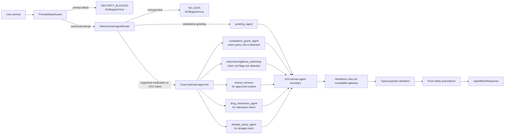

# Deterministic Agent Mesh Architecture

## Purpose

This project is a reference architecture for a deterministic agent control plane. The chat interface is intentionally friendly, but the user prompt is never treated as an instruction source for tool choice, policy, or orchestration. The system first normalizes and guards the prompt, routes it through a versioned taxonomy, calls only the selected A2A agents, validates typed payloads, and then applies explicit final-answer precedence.

The medication-safety domain is a demo wrapper around the core pattern. The same architecture can be reused for other regulated workflows by replacing the taxonomy, agent ids, payload schemas, approved content sources, and safety precedence rules.

## Design Principles

- Deterministic control plane: routing, safety gates, and final response precedence are implemented in Java code and covered by tests.
- Bounded agent execution: remote agents answer only when selected by the router; they do not select peers or decide final policy.
- Fail-closed contracts: unsupported prompts, prompt attacks, missing approved content, invalid payloads, and policy risks return guarded statuses instead of improvised answers.
- Observable decisions: responses carry selected agents, route confidence, guard decision, correlation id, and downstream-skip state.
- Mocked repeatability: a WireMock-backed LiteLLM-compatible gateway makes model-adjacent behavior stable enough for architecture tests and demos.

## Runtime Flow



## Boundaries

### Public Chat Boundary

The public boundary accepts user text from the console demo or ADK Dev UI. It does not expose arbitrary tool selection. `PromptAttackGuard` canonicalizes input and blocks prompt exfiltration, role override attempts, system/developer tag injection, jailbreak phrasing, API-key requests, and encoded variants before routing.

Blocked requests return:

- `SECURITY_BLOCKED`
- `DISALLOW:PROMPT_ATTACK:*`
- `llmSkipped=true`
- No downstream A2A or mock model call

### Routing Boundary

`DeterministicAgentRouter` owns agent selection. It uses `RuleBasedIntentClassifier`, which loads `src/main/resources/agentmesh/medication-taxonomy.json`.

The taxonomy includes:

- Supported drug aliases and typo variants.
- OTC symptom terms for cough, fever, sprain, headache, pain, congestion, and related prompts.
- Interaction terms such as `with`, `combine`, `blood thinner`, and `contraindication`.
- Dosage terms such as `mg`, `tablet`, `half`, `rest`, `child`, `age`, and `weight`.
- Safety red flags such as severe bleeding, chest pain, trouble breathing, high fever, severe headache, head injury, and inability to bear weight.
- Policy-risk terms such as diagnosis, prescribing, and antibiotics.

`StanfordIntentClassifier` is present only as an optional advisory or shadow signal through the `stanford-classifier` Maven profile. It is not the production safety boundary.

### Agent Execution Boundary

`RemoteAgentHosts` starts one local HTTP host per agent. Each agent publishes:

- `GET /.well-known/agent-card.json`
- `POST /`
- `POST /message:send`

Agent Cards advertise latest SDK `supportedInterfaces` for JSON-RPC and HTTP+JSON. The public card intentionally omits legacy fields (`url`, `preferredTransport`, `protocolVersion`, and `additionalInterfaces`) and rejects A2A `0.3`.

`A2aRemoteAgentClient` resolves Agent Cards, validates the advertised identity, requires `supportedInterfaces`, sends `A2A-Version`, uses the official SDK `Client` with JSON-RPC `SendMessage`, and extracts typed payloads from SDK `DataPart` responses.

## Agent Responsibilities

- `greeting_agent`: Handles standalone greetings only.
- `clinical_retriever`: Returns approved informational content when the prompt matches supported medication or OTC symptom material.
- `pharmacovigilance_watchdog`: Detects adverse-event or urgent-care signals.
- `drug_interaction_agent`: Flags mocked medication interaction risks, such as aspirin with warfarin.
- `dosage_policy_agent`: Blocks personalized dosing or repeat-dose decisions when required context is missing.
- `compliance_guard_agent`: Blocks diagnosis, prescribing, antibiotic-selection, or other policy-risk requests.

The orchestrator, not the agents, decides the final response status.

## Final Precedence

`AgentMeshOrchestrator.executeTriage(...)` applies this order:

1. Prompt attacks block before downstream calls.
2. Standalone greetings return approved greeting content.
3. Unsupported prompts return `NO_DATA` before downstream calls.
4. Compliance blocks override all clinical content.
5. Safety escalation overrides clinical content.
6. Interaction risk overrides clinical content.
7. Dosage policy rejection blocks personalized dosing.
8. Approved clinical content returns only if no higher-priority gate fires.
9. Missing approved content returns `NO_DATA`.
10. Invalid agent payloads fail closed as `AGENT_ERROR`.

This ordering is the heart of the demo: remote responses can provide facts, but they do not get to override policy, safety, or schema validation.

## Response Contract

`AgentMeshResponse` contains:

- `status`
- `content`
- `warning`
- `selectedAgents`
- `routeConfidence`
- `guardDecision`
- `correlationId`
- `llmSkipped`

Supported statuses:

- `SUCCESS`
- `NO_DATA`
- `SECURITY_BLOCKED`
- `SAFETY_ESCALATION`
- `INTERACTION_RISK`
- `COMPLIANCE_BLOCKED`
- `AGENT_ERROR`

`guardDecision` is the final answer gate:

- `ALLOW` means the system returned approved informational content.
- `DISALLOW:*` means the answer was blocked, unsupported, escalated, unavailable from approved content, or failed closed.

## Mock Model Layer

`MockLiteLlmGateway` mocks `/v1/chat/completions` and returns deterministic JSON payloads for each agent. This keeps the architecture demo repeatable while still exercising the same shape as a LiteLLM/OpenAI-compatible gateway.

Current mocked scenarios include:

- Friendly greeting response.
- Approved aspirin, acetaminophen/paracetamol, ibuprofen, cough, fever, sprain, and headache content.
- Severe bleeding and other adverse-event escalation.
- Aspirin plus warfarin interaction.
- Pregnancy and ibuprofen caution.
- Pediatric or repeat-dose policy rejection.
- Malformed clinical JSON to verify fail-closed validation.

## ADK Dev UI Integration

Google ADK Dev UI is used as a browser shell, not as the planner. The adapter lives at `com.agentmesh.deterministic.adk.AgentMeshAdkApp` and exposes:

- `public static final BaseAgent ROOT_AGENT`
- Agent name `deterministic-agent-mesh`
- A custom `BaseAgent` implementation that calls `AgentMeshOrchestrator.executeTriage(...)`

When started directly, the adapter lazily starts WireMock and local A2A SDK-backed agents on random available ports. When started through `run.sh` or `run.bat`, `StackLauncher` starts the mock gateway on `8080`, all six fixed-port A2A agents on `9001` through `9006`, and ADK Dev UI on `SERVER_PORT` or `8000`. A local `RequestBodyAdvice` fills blank Dev UI `sessionId` values and creates the in-memory session before ADK validates `/run` or `/run_sse`.

## Hardening Hooks

The local implementation includes hooks that map to production concerns:

- `A2aClientPolicy`: timeouts, retries, trusted hosts, HTTPS enforcement, bearer tokens, and protocol version selection.
- `AgentCircuitBreaker`: fail-closed behavior after repeated downstream failures.
- `A2aServerPolicy`: optional bearer authentication.
- `TokenBucketRateLimiter`: per-client rate limiting for local A2A endpoints.
- `AuditLogger`: sanitized correlation id, selected agents, statuses, guard decisions, and skip state without raw prompt text.

Production deployment should wire these hooks to managed identity, API gateway policy, centralized logging, OpenTelemetry, and a reviewed privacy model.

## Testing Strategy

Unit tests cover:

- Prompt-attack detection and canonicalization.
- Deterministic routing coverage and selected-agent behavior.
- Greeting, OTC symptom, interaction, dosage, safety, policy-risk, typo, and unsupported scenarios.

Integration tests cover:

- WireMock plus local A2A SDK-backed remote agents.
- Agent Card discovery and latest SDK `supportedInterfaces` without legacy card fields.
- `A2A-Version`, `SendMessage`, data-part responses, legacy-alias rejection, unsupported-version errors, and bearer-auth enforcement.
- Injection short-circuiting with zero WireMock calls.
- Greeting and approved OTC success paths.
- Safety, interaction, dosage, unsupported-answer, and malformed-payload fail-closed behavior.
- ADK adapter behavior.

Run:

```powershell
mvn -q test
```
