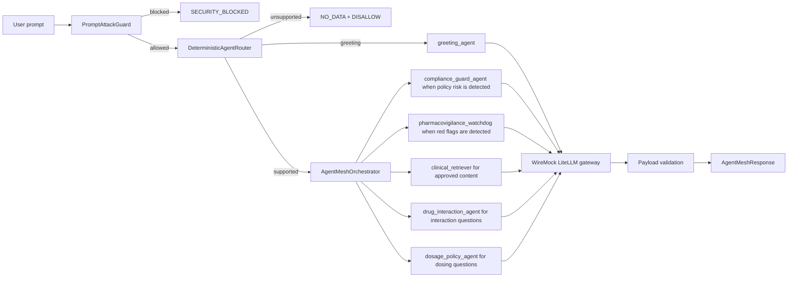

# Deterministic Agent Mesh Architecture

## Overview

Deterministic Agent Mesh separates the public chat boundary from the agent execution boundary. User text is never allowed to freely choose tools, agents, or instructions. The system first applies deterministic guards and taxonomy-backed routing, then calls a fixed set of remote agents through A2A Agent Card discovery.

The showcase domain is medication safety, but the architecture is generic: swap the versioned routing taxonomy and agent payload schemas to demonstrate another regulated workflow.

## Runtime Flow



## Main Components

### PromptAttackGuard

The guard canonicalizes input before routing:

- Lowercases and normalizes whitespace.
- URL-decodes repeated encodings.
- Expands base64-looking tokens when they decode to printable text.
- Blocks jailbreaks, prompt exfiltration, role override attempts, system/developer tag injection, and API-key/system-prompt requests.

Blocked prompts return `SECURITY_BLOCKED` and set `llmSkipped=true`.

### Intent Classification And Routing

The router uses deterministic route intents, not LLM planning. Standalone greetings become `GREETING`, unsupported prompts become `UNSUPPORTED`, and medication or OTC symptom prompts become `MEDICATION`.

`RuleBasedIntentClassifier` loads `src/main/resources/agentmesh/medication-taxonomy.json`, which contains supported drug aliases, OTC active ingredients, synonyms, typo variants, symptom triggers, interaction terms, dosage terms, safety red flags, and policy-risk terms.

`StanfordIntentClassifier` is present only as an advisory/shadow hook. It can be enabled with the `stanford-classifier` Maven profile and model path, but deterministic taxonomy routing remains authoritative for safety decisions.

The router decides whether a prompt is supported and selects only relevant agents with confidence metadata:

- `greeting_agent` for standalone greetings like `hi`.
- `clinical_retriever` for approved medication and common OTC symptom information.
- `pharmacovigilance_watchdog` when safety red flags such as severe bleeding, chest pain, trouble breathing, high fever, severe headache, or inability to bear weight are detected.
- `drug_interaction_agent` when multiple medicines or interaction terms are detected.
- `dosage_policy_agent` when dosage, pediatric, age, weight, or mg terms are detected.
- `compliance_guard_agent` when diagnosis, prescribing, or other policy-risk terms are detected.

### A2A Remote Agents

`RemoteAgentHosts` starts one local HTTP server per agent. Each host exposes:

- `GET /.well-known/agent-card.json`
- `POST /a2a/remote/v1/jsonrpc`
- `POST /a2a/remote/v1/message:send`

Agent Cards advertise A2A 1.0-style `supportedInterfaces` for JSON-RPC and HTTP+JSON. They also retain legacy Java ADK/A2A compatibility fields (`url`, `preferredTransport`, `protocolVersion`, and `additionalInterfaces`) because the current Java ADK dependency path still includes A2A 0.3-era DTOs.

`A2aRemoteAgentClient` resolves each Agent Card, validates the advertised agent identity, selects a supported interface, sends `A2A-Version`, uses JSON-RPC `SendMessage`, and parses typed payloads from A2A data parts or the legacy payload field.

The project keeps Google ADK and ADK A2A dependencies in Maven, but the current demo host is lightweight and local so it remains deterministic, fast, and UI-independent. A Maven profile is included for the A2A 1.x SDK reference path once you want to replace the local host with official SDK server/client wiring.

### Production Hardening Hooks

The local A2A layer includes production-oriented hooks:

- `A2aClientPolicy` for timeouts, retries, trusted hosts, HTTPS enforcement, bearer tokens, and protocol version selection.
- `AgentCircuitBreaker` to fail closed after repeated downstream agent failures.
- `A2aServerPolicy` and `TokenBucketRateLimiter` for optional bearer authentication and per-client request limiting.
- Sanitized audit logs that record correlation ids, agents, guard decisions, statuses, and skip state without raw prompt text.

### WireMock LiteLLM Gateway

`MockLiteLlmGateway` mocks `/v1/chat/completions` and returns agent-specific JSON payloads. This makes showcase behavior repeatable:

- Friendly greeting response.
- Approved aspirin response.
- Approved general OTC content for cough, fever, sprain, and headache.
- Severe bleeding escalation.
- Aspirin plus warfarin interaction.
- Pregnancy/ibuprofen caution.
- Pediatric dosage rejection.
- Malformed clinical JSON for fail-closed validation.

### Payload Validation

Every remote-agent payload is validated after parsing. Missing required fields, blank required text, unsupported payload types, and malformed JSON fail closed as `AGENT_ERROR`.

## Response Contract

`AgentMeshResponse` contains:

- `status`
- `content`
- `warning`
- `selectedAgents`
- `routeConfidence`
- `guardDecision`
- `correlationId`
- `llmSkipped`

`guardDecision` is the final answer gate, not only the prompt-attack gate:

- `ALLOW` means approved informational content was returned.
- `DISALLOW:*` means the answer was blocked, unsupported, escalated, unavailable from approved content, or failed closed.

Supported statuses:

- `SUCCESS`
- `NO_DATA`
- `SECURITY_BLOCKED`
- `SAFETY_ESCALATION`
- `INTERACTION_RISK`
- `COMPLIANCE_BLOCKED`
- `AGENT_ERROR`

## Safety Precedence

The orchestrator applies deterministic precedence:

1. Prompt attack blocks everything before downstream calls.
2. Standalone greetings route to `greeting_agent` and return approved greeting content.
3. Unsupported prompts return `NO_DATA` with `DISALLOW:UNSUPPORTED_MEDICAL_INTENT`.
4. Compliance blocks override clinical content.
5. Safety escalation overrides clinical content.
6. Interaction risk overrides clinical content.
7. Dosage policy rejection blocks personalized dosing.
8. Approved clinical content is returned only if no higher-priority gate fires.
9. Invalid agent payloads fail closed as `AGENT_ERROR`.

## Testing Strategy

Unit tests cover:

- Prompt-attack detection.
- Deterministic routing coverage.
- Agent selection for greeting, OTC symptom, interaction, dosage, safety, and policy-risk scenarios.
- Unsupported prompt rejection.

Integration tests cover:

- WireMock plus local A2A-capable remote agents.
- Agent Card discovery.
- A2A 1.0-style `supportedInterfaces`, `A2A-Version`, `SendMessage`, data-part responses, unsupported-method errors, unsupported-version errors, and bearer-auth enforcement.
- Injection short-circuit with zero WireMock calls.
- Greeting success through the greeting agent.
- Approved OTC responses for cough and fever prompts.
- Safety and interaction override behavior.
- Malformed JSON fail-closed behavior.

In this demo, "short-circuit" means the orchestrator returns before downstream A2A/model calls. Prompt attacks and unsupported non-medical prompts short-circuit; greetings and supported medication prompts call only the selected relevant agents. Supported medication prompts can still fail closed as `DISALLOW:NO_APPROVED_CONTENT` or another policy reason after selected agents run.

Run:

```powershell
mvn -q test
```

## ADK Dev UI Integration

Google ADK Dev UI is useful for browser-based agent testing, but it expects an ADK Java class with `public static ROOT_AGENT` of type `BaseAgent`.

This repository includes that adapter at `com.agentmesh.deterministic.adk.AgentMeshAdkApp`. It exposes `deterministic-agent-mesh` as a custom ADK `BaseAgent`.

The adapter:

- Defines `ROOT_AGENT`.
- Lazily starts WireMock and local A2A-capable remote agents.
- Calls `AgentMeshOrchestrator.executeTriage` directly for each Dev UI prompt.
- Returns the structured `AgentMeshResponse` as readable text.
- Keeps deterministic guard and routing decisions outside LLM control.

The ADK Dev UI can submit `/run_sse` with an empty `sessionId`. A local `RequestBodyAdvice` assigns a session id and creates the in-memory session before ADK validates the run request.

Start the Dev UI:

```powershell
mvn compile exec:java `
  "-Dexec.mainClass=com.google.adk.web.AdkWebServer" `
  '-Dexec.args="--adk.agents.source-dir=. --server.port=8000"'
```

Open `http://localhost:8000`, select `deterministic-agent-mesh`, and test the showcase prompts used by `DeterministicAgentMeshDemo`, including `hi`, `medince for cough`, fever, interaction, dosage, safety escalation, and unsupported prompts.
